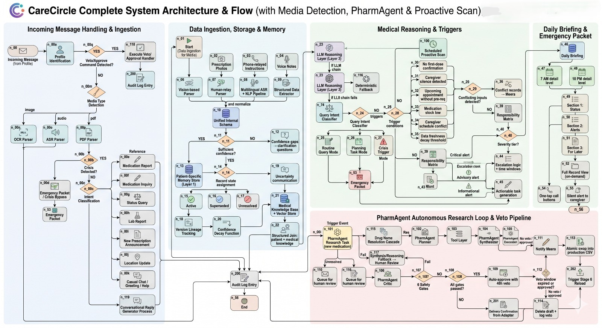
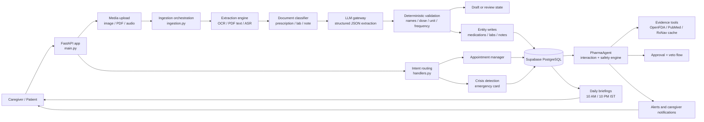
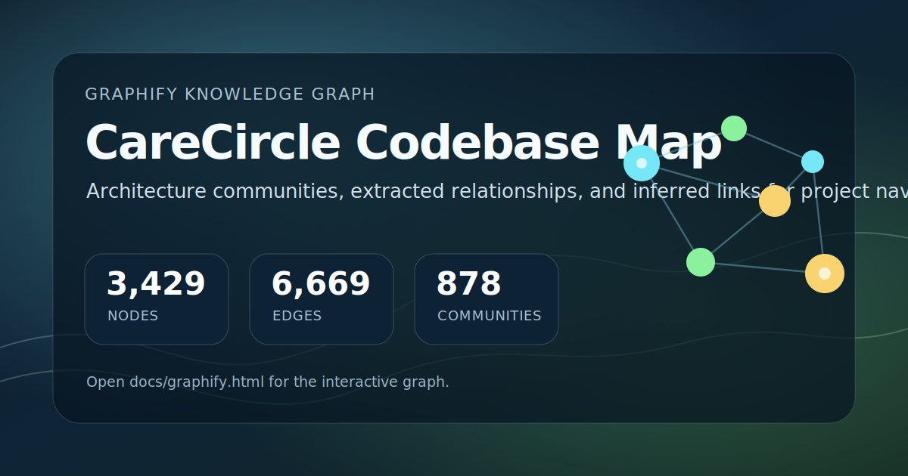

# CareCircle

CareCircle is a local-first caregiver coordination and medical-document ingestion system. It includes chat intent routing, document parsing, medication/lab extraction, PharmaAgent safety checks, appointment handling, caregiver notifications, and daily brief generation.

## Current Runtime

The current stable app entrypoint remains the root FastAPI module:

```powershell
.\venv\Scripts\python.exe -m uvicorn main:app --host 127.0.0.1 --port 8000 --reload
```

The restructuring work is intentionally staged. Large runtime modules such as `db.py`, `ingestion.py`, `pharma_agent.py`, and `main.py` are not moved until compatibility wrappers and verification coverage are in place.

## Baseline Verification

Run these checks before and after restructuring work:

```powershell
.\venv\Scripts\python.exe scripts\verify\run_baseline.py
```

Or run the individual checks:

```powershell
.\venv\Scripts\python.exe -m py_compile main.py db.py ingestion.py handlers.py
.\venv\Scripts\python.exe verify_appointment_workflow.py
.\venv\Scripts\python.exe verify_layers_4_6.py
.\venv\Scripts\python.exe verify_document_pipeline.py
.\venv\Scripts\python.exe verify_pharma_agent.py
```

See [docs/BASELINE_REPORT.md](docs/BASELINE_REPORT.md) and [docs/KNOWN_ISSUES.md](docs/KNOWN_ISSUES.md).
Start with [docs/INDEX.md](docs/INDEX.md) for the full documentation map.

## Vercel Deployment

This repo includes a Vercel ASGI entrypoint at `api/index.py` and routes all requests through the existing FastAPI app in `main.py`.

```powershell
npx vercel login
npx vercel --prod --yes
```

Configure production secrets in the Vercel dashboard from `.env.example`; do not upload the local `.env` file.

## Repository Layout

```text
carecircle/          Future package layout and compatibility wrappers
docs/                Architecture, operations, audits, and baseline notes
migrations/          SQL migrations for Supabase/PostgreSQL
scripts/             Operational and verification scripts
tests/               Test suite and fixtures
uploaded_media/      Local uploaded media storage, ignored by Git
```

## System Architecture



The current runtime is organized around a fast FastAPI entrypoint, asynchronous media processing, deterministic validation, database-backed memory, and PharmaAgent safety review before caregiver-facing outputs.



## Safety Rules For Restructure

- Keep old root imports working until all runtime callers are migrated.
- Move small low-risk modules before large central modules.
- Run verification after each migration batch.
- Keep database SQL access centralized through `db.py` or its package-compatible facade.

## Graphify Knowledge Graph

[](docs/graphify.html)

Open the generated project graph here: [docs/graphify.html](docs/graphify.html).
